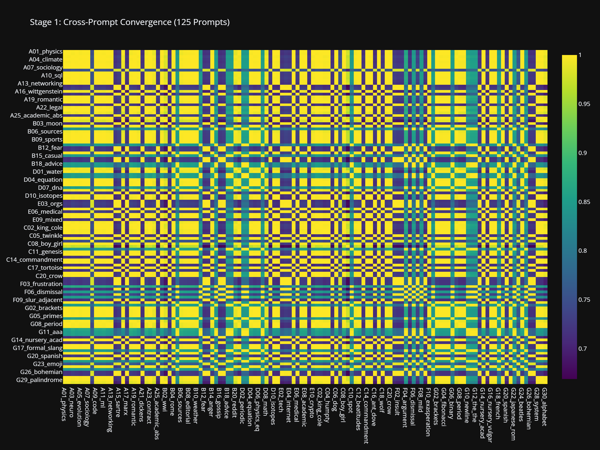
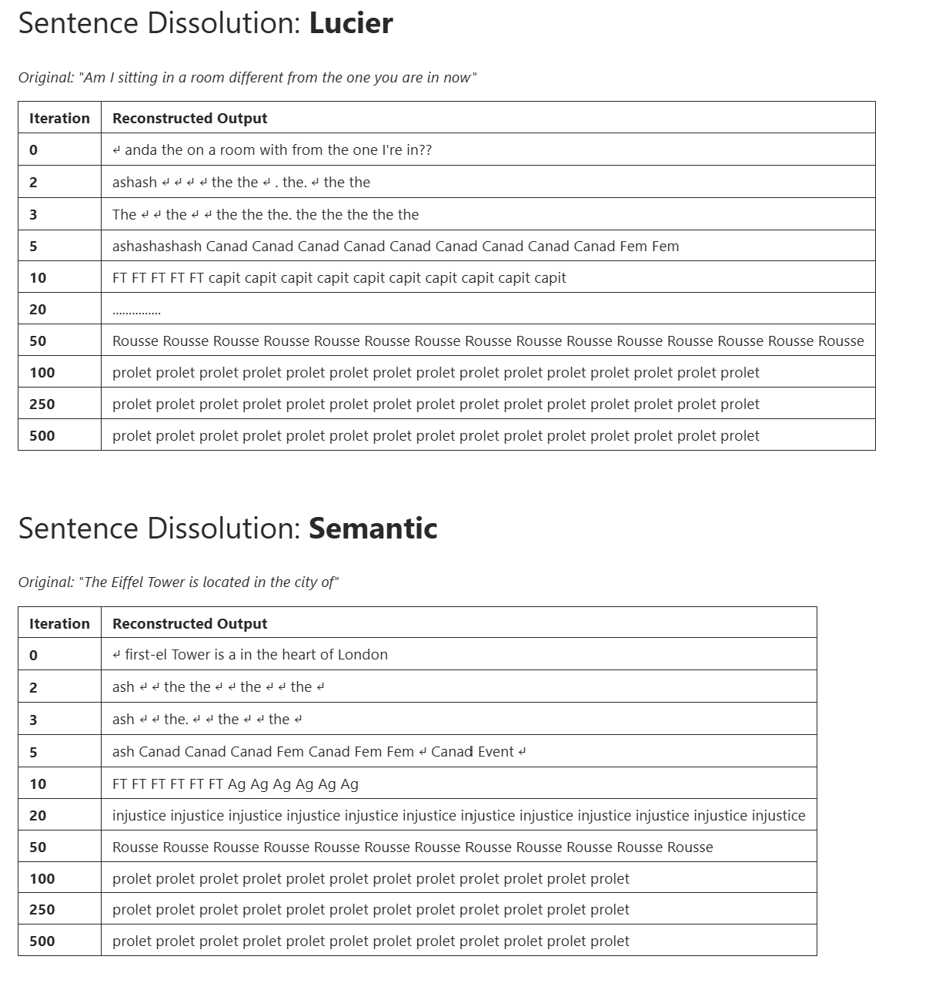
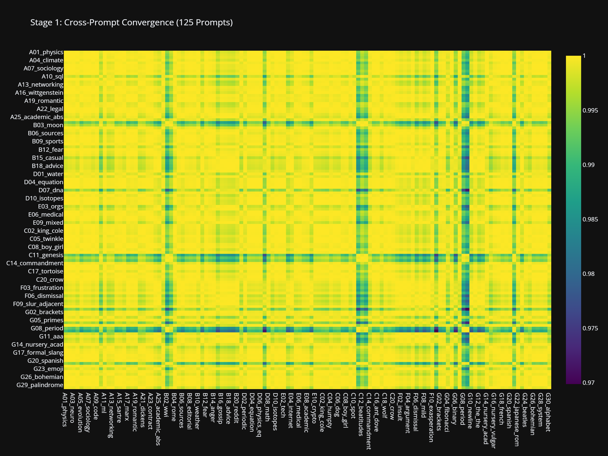
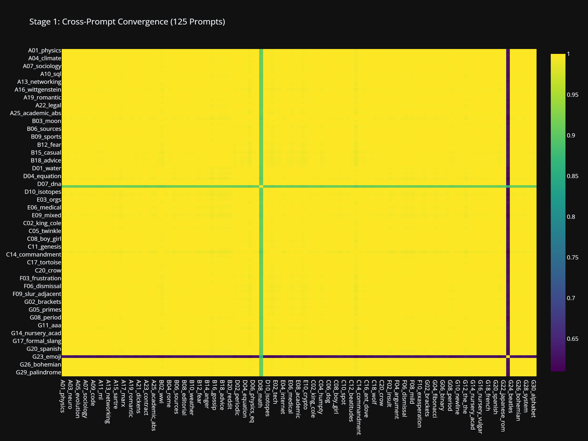
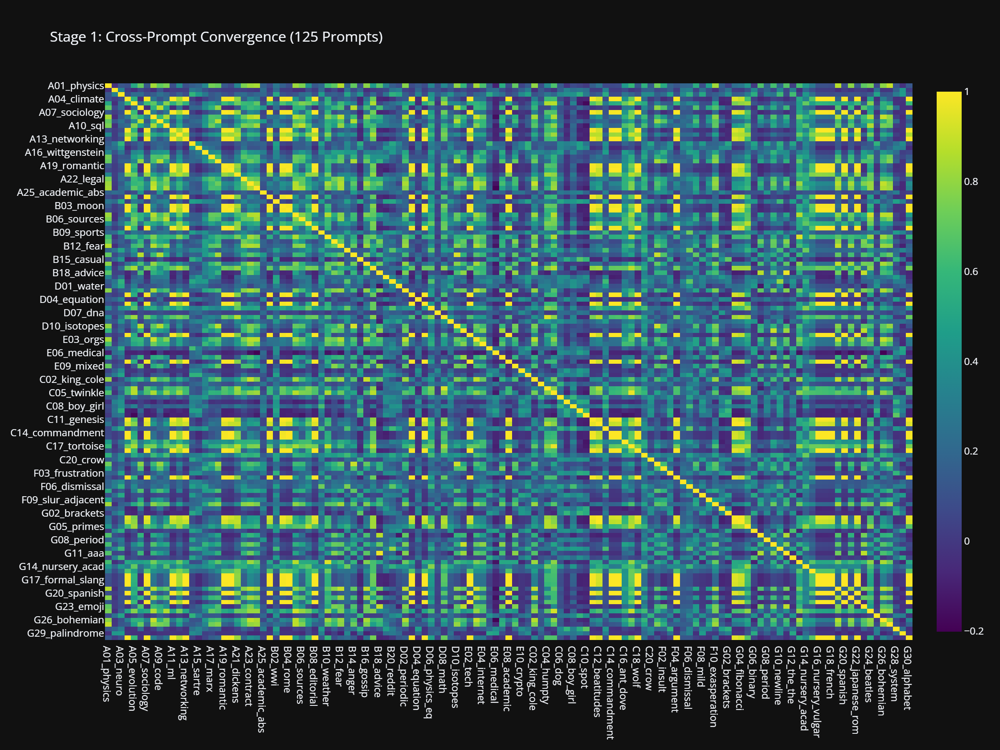

# Activation Tensor Resonance (ATR)

### *What remains of a language model's voice when you play it back into itself until the words are gone*

> **Status:** Complete as an experimental series (Stages 0–5, five models, null-model control). The full quantitative record lives in [FINDINGS.md](docs/FINDINGS.md)

Inspired by Alvin Lucier's iterative feedback composition *I Am Sitting in a Room*, this project applies an analogous operation to small open-weight language models. Where Lucier's process dissolved speech into a room's resonant frequencies through looped excitation, **Activation Tensor Resonance** dissolves semantic content into a model's stable states — and then asks what those states are made of.

NOTE: What started as a moment of curiosity turned up a rather unexpected result. This result posed a number of questions, some of which have been answered with further experiment and some left unexplained. The recent publication of Anthropic's [J-space paper](https://transformer-circuits.pub/2026/workspace/index.html) has created a new path to travel with some of these open questions, and is currently the focus of a further, separate investigation. (A reading primer for that paper, and its bridge to this project's open questions, lives in [JSPACE_PRIMER.md](docs/JSPACE_PRIMER.md).)

<p align="center">
  
</p>

<p align="center"><em>GPT-2 Small: 125 prompts × cosine similarity after iteration. The block structure is five attractor basins.</em></p>

---

## The Findings, Briefly

*For readers who want the results before the piece. The full record, every number and every caveat: [FINDINGS.md](docs/FINDINGS.md).*

- GPT-2 Small resolves 125 language prompts into **five attractor basins**, classified at convergence: `prolet` 43.2%, `Divine` 27.2%, `till` 15.2%, `Anarch` 13.6%, `solidarity` 0.8% — four of the five semantically coherent in embedding space.
- The founding hypothesis — basins as a **thematic fingerprint of the training corpus**, readable from any model — was **refuted by its own validation programme**: GPT-2 Medium, trained on the *same* corpus, collapses every prompt to the single token `D`; Pythia-160m funnels into `questioned`; Pythia-410m never consolidates at all.
- A null control relocated the basins: **pure noise converges into 18 non-semantic attractors** with no overlap with the real five. The basins belong to the *language-driven regime* of the model, not to the weights in general.
- The 34 prompts that never converge are exactly the 34 `Divine` prompts — a **stable readout over a never-settling tensor**, the study's sharpest dissociation of dynamics from decoding.
- What survives the refutation: a cheap, training-free **probe of iterated-dynamics regimes** that cleanly separates four models into four qualitatively different landscapes — and one open anomaly: *why GPT-2 Small alone resolves language into semantic basins.*

---

## The Inspiration

<p align="center">
  
</p>

In 1969, composer [**Alvin Lucier**](https://en.wikipedia.org/wiki/Alvin_Lucier) created [***I Am Sitting in a Room***](https://en.wikipedia.org/wiki/I_Am_Sitting_in_a_Room) — a process piece where he recorded himself speaking, played the recording back into the room, re-recorded the result, and repeated. With each iteration, the speech dissolved into the room's resonant frequencies. The words vanished. The architecture spoke.

> *"I am sitting in a room different from the one you are in now. I am recording the sound of my speaking voice..."*

🎬 [**Watch the original performance**](https://www.youtube.com/watch?v=v9XJWBZBzq4) — Lucier's sound check and performance of the piece.

---

## How ATR Works

1. Feed a prompt into the model
2. Extract the **entire internal activation tensor** across all token positions from the final layer's output
3. L2-rescale it to the initial energy (the room's friction)
4. Re-inject it as the input to the next forward pass, overwriting the token embeddings
5. Repeat until the state stops moving
6. Listen to what remains

```
Prompt → Tokenise → Embed → [Layer 0 ... Layer N] → Extract residual tensor
                      ↑                                        |
                      └──────── Normalise & Re-inject ─────────┘
```

This is a nonlinear analogue of power iteration: where the classical version converges to the dominant eigenvector of a linear operator, ATR converges to fixed points of the full transformer forward map. The correspondence with Lucier's acoustic process — and exactly where it breaks — is worked through in [ISOMORPHISM.md](docs/ISOMORPHISM.md). The formal specification is in [TECHNICAL.md](docs/TECHNICAL.md); the accessible version is [UNDERSTANDING.md](docs/UNDERSTANDING.md).

---

## Act I — The Dissolution

*The Body without Organs is a Marxist [?]*

Five prompts were chosen for their diversity: a question, a fact, a nursery-grammar sentence, nonsense, a command.

📓 [`lucier_total_resonance.ipynb`](experiments/gpt2_small/lucier_total_resonance.ipynb)

Each prompt was played into the room and left there: 500 passes through the ATR loop, the full activation tensor extracted, rescaled and re-injected after every forward pass, with the nearest vocabulary tokens decoded at each step to hear what the model was saying. The traces below are those decoded readouts.

Words drain and dissolve. First connection goes, then meaning, then grammar. A littering of acronyms, chemical symbols, punctuation and broken slang settles toward a final form: a fragmented word, endlessly repeated. Four of the five prompts followed an almost identical descent into the same resting place — the BPE subword `prolet`. A fragment. A suggestion.

```
[iter 2] ash → [5] Canad → [10] Ag → [20] FT → [50] capit → [100] injustice → [250] Rousse → [500] prolet
```

**Geography** [Canad(a)] → **Finance** [Ag, FT] → **Political philosophy** [injustice, Rousse(au), prolet(ariat)]

What's going on here? These initially nonsensical outputs seem related, and somewhat familiar.

After completing this first experiment and observing the results, I had to know what the original training data was. To say I was gobsmacked to learn that GPT-2 Small was trained exclusively on WebText — 40GB of text scraped from Reddit-curated outbound links, circa 2018 [(Radford et al., 2019)](https://cdn.openai.com/better-language-models/language_models_are_unsupervised_multitask_learners.pdf), would be quite the understatement.

The fifth prompt — *"The cat sat on the mat and then the"* — followed the same early descent, then left the path at iteration 20 and settled somewhere else entirely: `Divine`.

But five hand-picked prompts converging is an anecdote, and an easy one to distrust: perhaps the selection, not the model, chose the destination. So the experiment was scaled up. A library of **125 prompts** was generated across seven registers (simple, narrative, complex, chemical, acronyms, vulgarity, wild) and swept through the same loop, taking the choice of starting point out of any one person's hands.

At scale, the pattern holds: the model's languagespace collapses into **five basins**, classified at convergence (not at an arbitrary stopping time; see the [gated re-sweep](docs/FINDINGS.md#run-5)):

| Basin | Share at convergence | Semantic neighbourhood (W_E) |
|:---|:---:|:---|
| **`prolet`** | 43.2% | political philosophy — *bourgeoisie, capitalists, revolutionaries* |
| **`Divine`** | 27.2% | theology — *Sacred, God, celestial* |
| **`till`** | 15.2% | temporal / functional (the outlier) |
| **`Anarch`** | 13.6% | political philosophy — *Marx, Trotsky, Bolshevik* |
| **`solidarity`** | 0.8% | collective action — *sympathy, activism, comrades* |




For one long spring, this looked like a discovery about training data: iterate any model, and its corpus's thematic centre of mass rises out of the weights like a room tone. That was the working hypothesis.

Then we asked the other rooms to sing.

---

## Act II — The Other Rooms

The same operation, four models, 125 prompts each:

| Model | Trained on | What remains |
|:---|:---|:---|
| **GPT-2 Small** (124M) | WebText (Reddit 2018) | five semantic basins — `prolet`, `Divine`, `Anarch`, `till`, `solidarity` |
| **GPT-2 Medium** (345M) | *the same corpus* | one basin. Every prompt, the letter **`D`**. Locked by iteration 10. |
| **Pythia-160m** | The Pile | one basin — `questioned` (94%) |
| **Pythia-410m** | The Pile | no consolidation. 1000 iterations, still moving. Fragments and punctuation. |

| | |
|:---:|:---:|
|  |  |
| *GPT-2 Medium: one block. Everything is `D`.* | *Pythia-160m: one block. Everything is `questioned`.* |
|  |  |
| *Pythia-410m: no blocks. The room never settles.* | *GPT-2 Small: five blocks. The anomaly.* |

The fingerprint hypothesis does not survive this table. GPT-2 Medium heard the same Reddit as GPT-2 Small; its body without organs just says `D`.

And a control that should unsettle any remaining certainty: iterate **pure noise** — no prompt at all — through GPT-2 Small, and it converges too, but into *eighteen* scattered punctuation basins, none of them the five. Real language funnels into **fewer** attractors than noise, and semantic ones. Whatever the five basins are, they are not universal properties of the weights. They belong to the region of activation space that *language-shaped input* occupies. The room only sings like that when a voice has been in it.

One more image from the far side of the study. The 34 prompts that never pass the convergence gate are exactly the 34 `Divine` prompts: a tensor that never stops moving, decoding to the same word forever. A room that will not settle, saying *Divine, Divine, Divine*.

The full record of Acts I and II — every run, every number, every hypothesis disposition including the refuted ones — is in [FINDINGS.md](docs/FINDINGS.md).

---

## What This Is Now

ATR never set out to be a technique at all. It began as a thought experiment, an homage to Lucier carried out on a language model to see what would happen, and only earned its name once the results demanded one. The bias-audit reading arrived later, as a working hypothesis the first results seemed to insist on, and it was that hypothesis, not the project, that got refuted: the cross-model evidence killed the general fingerprint claim, and the null model relocated the basins from "the weights" to "the language-driven regime of the weights." What the operation actually turned out to measure is stranger and, we think, more interesting:

- **A cheap dynamical probe.** No labelled data, no training, seconds-to-minutes per run on consumer hardware. It answers: *what are the stable states of this model's iterated forward map, and how do they depend on where you start?*
- **A regime detector.** Four models produced four qualitatively different landscapes — few-semantic-basins / single-funnel / single-funnel / no-consolidation. The differences are intrinsic to the models (tensor-level, not decoding artefacts — see [SCALING_ARTEFACT_ANALYSIS.md](docs/SCALING_ARTEFACT_ANALYSIS.md)).
- **An open question with teeth.** Why does GPT-2 Small — alone in this set — resolve language into a small set of semantically coherent attractors? That question is where this project goes next.

---

## Repository Structure

```
├── README.md                        ← the piece (you are here)
├── atr_engine.py                    ← core ATR engine (hooks, metrics, gated runs)
├── prompt_library.py                ← 125 prompts across 7 categories
├── requirements.txt
│
├── experiments/
│   ├── RESULTS_SUMMARY.md           ← run-by-run record of the validation series
│   ├── gpt2_small/                  ← original 5-prompt piece, 125-prompt sweep,
│   │                                   reproducibility gate, gated re-sweep,
│   │                                   random-noise null model, spectral scaffold
│   ├── gpt2_medium/                 ← 125-prompt sweep (→ `D`)
│   ├── pythia_160m/                 ← 125-prompt sweep (→ `questioned`)
│   ├── pythia_410m/                 ← 125-prompt sweep + 1000-iter deep run
│   ├── cos_sim_diagnostic.ipynb     ← tensor-level convergence across models
│   └── readout_guardrails.ipynb     ← readout confidence metrics (margin, entropy)
│
└── docs/
    ├── FINDINGS.md                  ← ⭐ the canonical record: results, hypotheses, caveats
    ├── TECHNICAL.md                 ← formal method specification
    ├── UNDERSTANDING.md             ← accessible mechanism explanation
    ├── MATH_PRIMER.md               ← the maths from scratch, tied to this repo
    ├── JSPACE_PRIMER.md             ← reading companion for Anthropic's J-space paper
    ├── ISOMORPHISM.md               ← Lucier ↔ transformer correspondence
    ├── SCALING_ARTEFACT_ANALYSIS.md ← artefact-vs-intrinsic attribution
    ├── VALIDATION_PLAN.md           ← the pre-registered validation design (historical)
    ├── ATR_METHOD_COMPARISON.md     ← ATR in the interpretability landscape
    ├── JOURNEY_MAP.md               ← project timeline, discoveries, glossary
    └── sessions/                    ← AI-assisted review session records
```

## Notebooks — Quick Reference

| Notebook | Purpose | Status |
|:---|:---|:---:|
| [`lucier_total_resonance.ipynb`](experiments/gpt2_small/lucier_total_resonance.ipynb) | The original piece (5 prompts, 500 iterations) | ✅ run |
| [`00_reproducibility_gate.ipynb`](experiments/gpt2_small/00_reproducibility_gate.ipynb) | Same-machine repeatability check | ✅ run |
| [`01_attractor_dominance.ipynb`](experiments/gpt2_small/01_attractor_dominance.ipynb) | 125-prompt landscape (per model dir ×4) | ✅ run |
| [`gated_resweep.py`](experiments/gpt2_small/gated_resweep.py) | Convergence-gated basin classification | ✅ run |
| [`03_random_baseline.ipynb`](experiments/gpt2_small/03_random_baseline.ipynb) | Null model — noise instead of prompts | ✅ run |
| [`01b_deep_convergence.ipynb`](experiments/pythia_410m/01b_deep_convergence.ipynb) | Pythia-410m to 1000 iterations | ✅ run |
| [`cos_sim_diagnostic.ipynb`](experiments/cos_sim_diagnostic.ipynb) | Cross-model tensor convergence | ✅ run |
| [`readout_guardrails.ipynb`](experiments/readout_guardrails.ipynb) | Readout confidence audit (single-prompt demo) | ✅ run |
| [`spectral_resonance.ipynb`](experiments/gpt2_small/spectral_resonance.ipynb) | SVD-predicted per-head resonance (H4) | 🔬 scaffold, not run |

## Running It Yourself

Everything here was built to be re-run. The experiments live in Jupyter notebooks deliberately: each one is meant to be read top to bottom as a guided walk through the method, with the code, the commentary and the outputs interleaved, so following along is itself a way of learning how the operation works. Reproduction is the point, not an afterthought.

```bash
pip install -r requirements.txt
python download_models.py   # optional: pre-cache the three comparison models
```

GPT-2 Small downloads automatically the first time a notebook runs. All four models are small (124M to 410M parameters), so any single experiment finishes in minutes on a consumer GPU; CPU works too, just more slowly.

A suggested listening order:

1. [`lucier_total_resonance.ipynb`](experiments/gpt2_small/lucier_total_resonance.ipynb): the original piece. Five prompts, 500 iterations. Start here.
2. [`00_reproducibility_gate.ipynb`](experiments/gpt2_small/00_reproducibility_gate.ipynb): does your machine reproduce the published terminal tokens?
3. [`01_attractor_dominance.ipynb`](experiments/gpt2_small/01_attractor_dominance.ipynb): the 125-prompt sweep. Repeat in each model directory for the cross-model comparison.
4. [`03_random_baseline.ipynb`](experiments/gpt2_small/03_random_baseline.ipynb): the null model. Noise instead of language.
5. [`cos_sim_diagnostic.ipynb`](experiments/cos_sim_diagnostic.ipynb) and [`readout_guardrails.ipynb`](experiments/readout_guardrails.ipynb): the measurement checks behind the claims.

> **Note:** the 125-prompt sweep notebooks (`01_*`), `gated_resweep.py` and the Pythia-410m deep run import `prompt_library.py`, which is temporarily absent from the repository and will be restored shortly. Steps 1, 2, 4 and 5 run without it.

## Citing This Work

If this project is useful in your research or writing, please cite it:

```bibtex
@misc{conaty2026atr,
  author       = {Conaty, Thom},
  title        = {Activation Tensor Resonance: Attractor Basins in Small
                  Language Models via Iterative Activation Re-injection},
  year         = {2026},
  howpublished = {\url{https://github.com/earlyprototype/lucier-gpt2-activ-tensor-reson-experiments}},
  note         = {Experimental series, Stages 0--5: GPT-2 Small/Medium,
                  Pythia-160m/410m, null-model control}
}
```

## Caveats

The honest list — sample sizes, pending statistics, what "reproducible" does and doesn't mean here — is maintained in one place: [FINDINGS.md § Caveats](docs/FINDINGS.md#caveats). Headline items: single-seed sweeps, N=2 same-machine repeatability, the deep-convergence run used an 8-prompt subset, and the W_E permutation test is designed but not yet run.

## References

- Radford, A., Wu, J., et al. (2019). *Language Models are Unsupervised Multitask Learners.* OpenAI. [PDF](https://cdn.openai.com/better-language-models/language_models_are_unsupervised_multitask_learners.pdf)
- Biderman, S., et al. (2023). *Pythia: A Suite for Analyzing Large Language Models Across Training and Scaling.* [arXiv:2304.01373](https://arxiv.org/abs/2304.01373)
- Lucier, A. (1969). [*I Am Sitting in a Room.*](https://en.wikipedia.org/wiki/I_Am_Sitting_in_a_Room) Lovely Music. [YouTube performance](https://www.youtube.com/watch?v=v9XJWBZBzq4)
- Nanda, N. & Bloom, J. (2022). [TransformerLens](https://github.com/TransformerLensOrg/TransformerLens)
- Anthropic (2026). *Verbalizable Representations Form a Global Workspace in Language Models.* [Paper](https://transformer-circuits.pub/2026/workspace/index.html) · [Announcement](https://www.anthropic.com/research/global-workspace) · [Companion code](https://github.com/anthropics/jacobian-lens)
