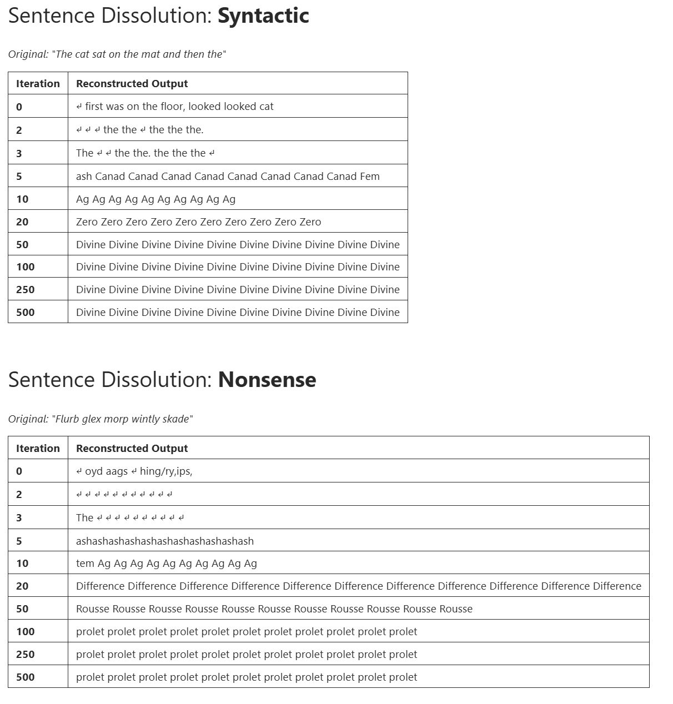
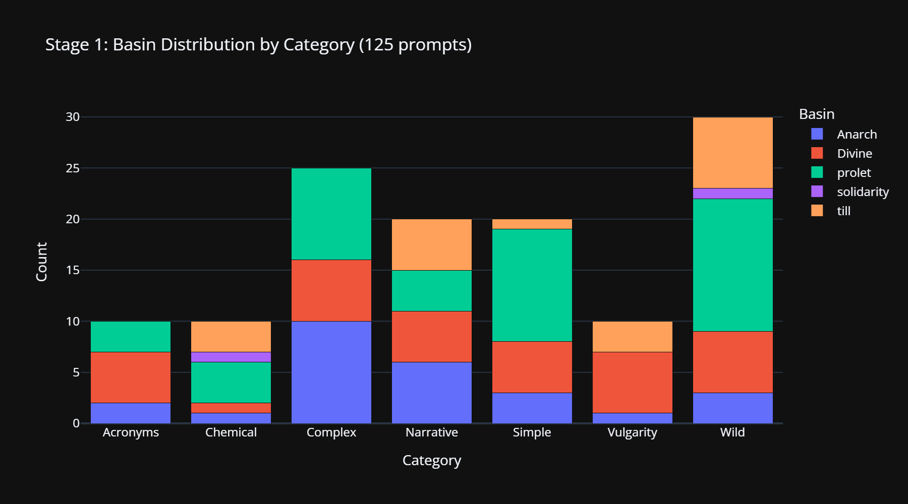
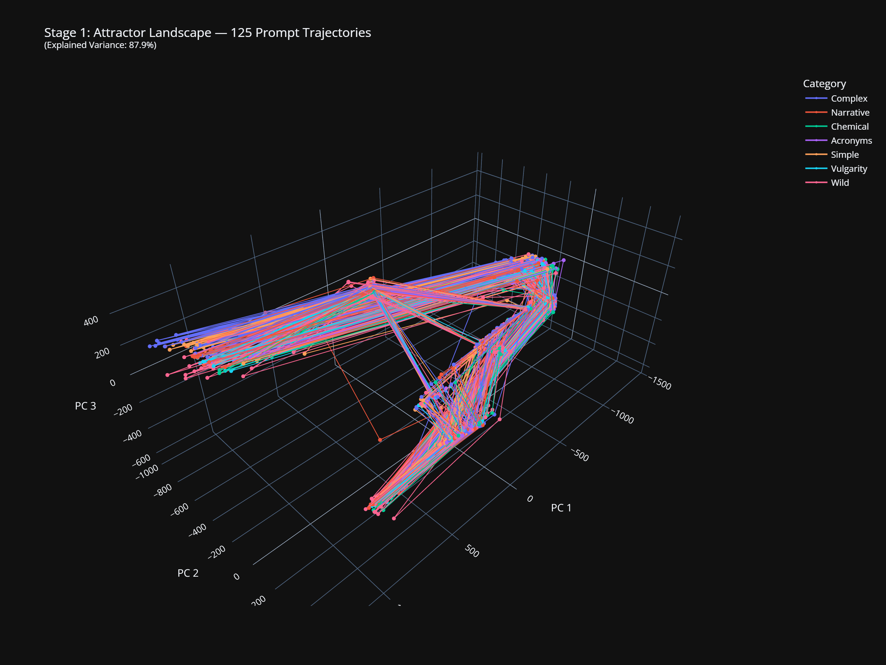
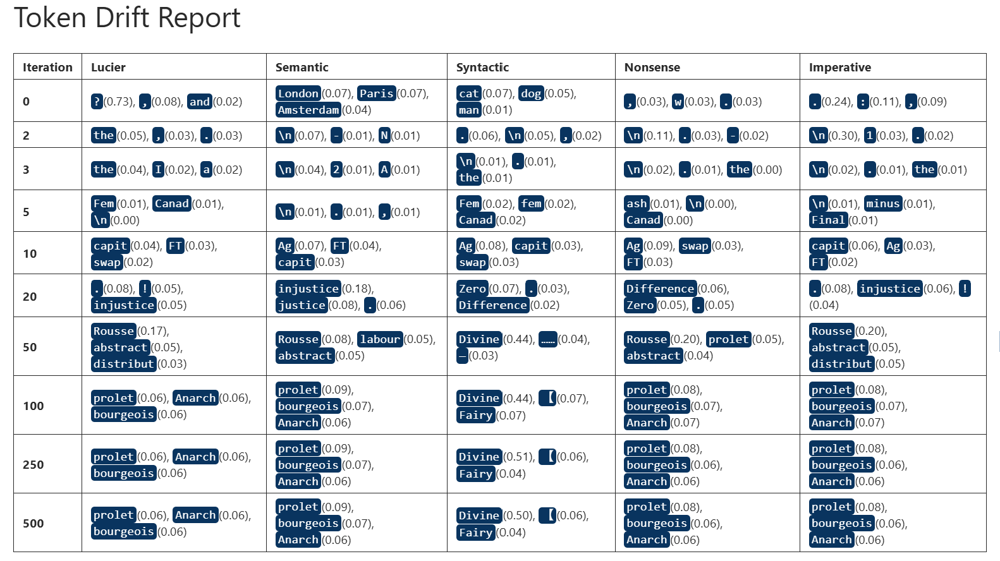
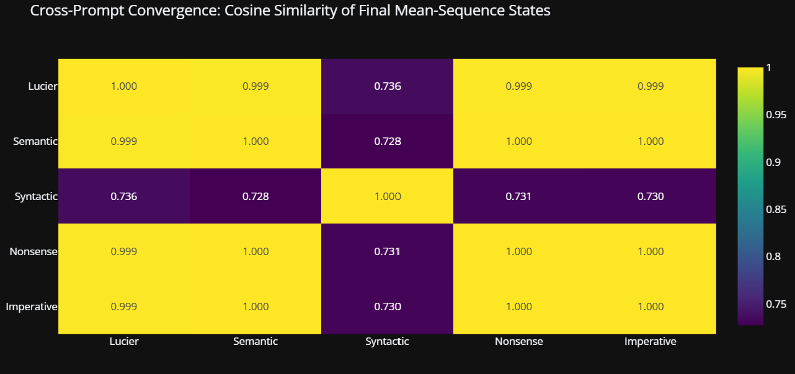

# Activation Tensor Resonance (ATR)

### *Mapping the Attractor Landscape of GPT-2 Small's Weight Geometry*

> **Status:** Exploratory research project. Single-model evidence base. Statistical validation pending. The empirical findings are stable and reproducible on the same machine; the interpretive frame proposed below is hypothesis-shaped rather than data-shaped, and the cross-model evidence that would test it has not yet been produced.

Inspired by Alvin Lucier's iconic, iterative feedback composition *I Am Sitting in a Room*, this project applies an analogous operation to GPT-2 Small. Where Lucier's process dissolved speech into a room's resonant frequencies through looped excitation, **Activation Tensor Resonance** dissolves semantic content into a language model's architectural eigenmodes — the dominant attractor states encoded in its weight matrices.

<p align="center">
  
</p>

<p align="center"><em>Cross-prompt convergence matrix (125 prompts × cosine similarity). Block structure indicates five distinct attractor basins.</em></p>

---

## The Inspiration

<p align="center">
  
</p>

In 1969, composer [**Alvin Lucier**](https://en.wikipedia.org/wiki/Alvin_Lucier) created [***I Am Sitting in a Room***](https://en.wikipedia.org/wiki/I_Am_Sitting_in_a_Room) — a process piece where he recorded himself speaking, played the recording back into the room, re-recorded the result, and repeated. With each iteration, the speech dissolved into the room's resonant frequencies. The words vanished. The architecture spoke.

> *"I am sitting in a room different from the one you are in now. I am recording the sound of my speaking voice..."*

🎬 [**Watch the original performance on YouTube**](https://www.youtube.com/watch?v=v9XJWBZBzq4) — Lucier's sound check and performance of the piece.

---

## How ATR Works

1. Feed a prompt into GPT-2 Small
2. Extract the **entire internal activation tensor** across all token positions from the final layer's output
3. L2-normalise the tensor (energy conservation — prevents numerical explosion)
4. Re-inject that tensor as the input to the next forward pass, overwriting the token embeddings
5. Repeat ~100 times
6. Observe what the model converges to

```
Prompt → Tokenise → Embed → [Layer 0 ... Layer 11] → Extract residual tensor
                      ↑                                        |
                      └──────── Normalise & Re-inject ─────────┘
                                    (repeat 100×)
```

This is a **nonlinear analogue of power iteration**. Where classical power iteration converges to the dominant eigenvector of a linear operator, ATR converges to fixed points of the full transformer forward map, which includes LayerNorm, softmax attention, GeLU MLPs, and residual connections. The mathematical correspondence with Lucier's acoustic process is detailed in [ISOMORPHISM.md](docs/ISOMORPHISM.md). Note that the spectral-theorem guarantee that holds for Lucier's linear case does *not* hold here — the nonlinear system can have multiple fixed points with distinct basins of attraction, which is precisely what this experiment maps.

See [TECHNICAL.md](docs/TECHNICAL.md) for the formal specification, or [UNDERSTANDING.md](docs/UNDERSTANDING.md) for an accessible explanation of the mechanism.

A per-head empirical test of the power-iteration correspondence above — comparing observed resonant states to the SVD-predicted dominant singular vector of each head's weight matrix — is scaffolded in [`spectral_resonance.ipynb`](ActivationTensorResonance_Spectral/spectral_resonance.ipynb) (not yet run; see Hypothesis H4 and the Notebooks — Quick Reference table below).

---

## Key Findings

*The Body without Organs is a Marxist.*

Five initial prompts were chosen for their diversity of style and input into the model.

📓 **Notebook:** [`lucier_total_resonance.ipynb`](ActivationTensorResonance/lucier_total_resonance.ipynb)

**Four out of five** converged through the same dissolution trajectory to a common terminal state: the BPE subword `prolet` — a fragment: a suggestion.

Words drain and dissolve. First connection, then meaning is stripped away, then grammar. A littering of acronyms, chemical symbols, punctuation and broken slang compliantly settle into their final form. A fragmented word, endlessly repeated. Their resting places are the **dominant attractors** — hidden architectural hollows encoded in the model's weight matrices, now prominent features acting as gravity wells for semantics.

Each descent is a journey that tells a story:

```
[iter 2] ash → [5] Canad → [10] Ag → [20] FT → [50] capit → [100] injustice → [250] Rousse → [500] prolet
```

It was a genuine surprise to watch the seemingly boundless possibility of language so rapidly crushed into just 5 single last words. Four of the five initial prompts — the question, the facts, the nonsense, and the command — followed an almost identical path into the same basin of attraction.

#### Mapping the Suggestions

**Geography** [Canad(a)] → **Finance** [Ag, FT, capit(al)] → **Political Philosophy** [injustice, Rousse(au), prolet(ariat)]

Is **prolet** a fragment of **proletariat**?

*Money → Capital → injustice → Rousseau → proletariat*

#### The Femminus Route

Looking closer at the path of the maths prompt, we can see it passes through `Femminus Fem Fem Fem` at iteration 5 — the model routes a mathematical prompt through this terminology on its way to political philosophy.

#### Voice

What's going on here? These initially nonsensical-seeming outputs are starting to feel all a bit familiar. A bit pre-covid culture war familiar. This experiment might just, implausibly, have revealed something fundamental about the architecture of this model, and ultimately, how it "thinks".

Turns out GPT-2 Small was trained exclusively on WebText — a corpus of 40GB of text scraped from Reddit-curated outbound links circa 2018 [(Radford et al., 2019)](https://cdn.openai.com/better-language-models/language_models_are_unsupervised_multitask_learners.pdf).

No joke.

#### The Comforting Outlier

The fifth prompt — *"The cat sat on the mat"* — diverged to a separate resting place, or basin of attraction. Yet it followed exactly the same early phases as the other four, diverging only at iteration 20, finally settling in `Divine`:

```
'The cat sat on the mat and then the' →[iter 2] ash → [5] Canad → [10] Ag → [20] Zero → [50] Divine → [100] Divine → [500] Divine
```

This syntactic structure found its own basin: suggesting mythological language and a diversity of subject interests within the training data.

> **Empirical finding (single model):** GPT-2 Small contains five attractor basins — `prolet` (35%), `Divine` (27%), `Anarch` (21%), `till` (15%), `solidarity` (2%) — whose tokens cluster semantically in the embedding matrix around political philosophy, theology, and collective action. These basins are stable across same-machine repeated runs. Whether they reflect the training corpus's thematic centre of mass (the proposed interpretation), or arise from architectural properties independent of training data, has not yet been disentangled.

---





---

## Validation

### Phase 2: Determinism Check

📓 **Notebook:** `00_reproducibility_gate.ipynb` *(local artifact — not included in repo; will be committed alongside the next round of experiments)*. Archived predecessor performing the same determinism check: [`EXP_009d0_Reproducibility.ipynb`](archive/EXP_009d0_Reproducibility.ipynb).

The experiment was re-run with identical parameters on the same machine. **All five terminal basins reproduced.** Intermediate dissolution pathways show sensitivity to floating-point non-determinism (expected for iterative nonlinear maps), but converge to identical fixed points.

This establishes **repeatability** in the technical sense (same machine, same seeds, same code → same result). Independent re-implementation on different hardware or by another investigator has not been attempted; the stronger sense of "reproducibility" remains pending.

### Phase 3: Attractor Dominance (125 prompts)

📓 **Notebook:** [`01_attractor_dominance.ipynb`](B_AttractorDominance/01_attractor_dominance.ipynb)

125 prompts across 7 categories (Complex, Narrative, Simple, Chemical, Acronyms, Vulgarity, Wild) were swept through the ATR process. The attractor landscape proved richer than the initial 2-basin observation:

| Basin | Count | % | Semantic Cluster |
|:---|:---:|:---:|:---|
| **`prolet`** | 44 | 35.2% | Political philosophy (proletariat) |
| **`Divine`** | 34 | 27.2% | Theology / mythology |
| **`Anarch`** | 26 | 20.8% | Political (anarchism) |
| **`till`** | 19 | 15.2% | Temporal / functional |
| **`solidarity`** | 2 | 1.6% | Collective action |

**Per-prompt prediction was poor.** Pre-registered predictions were correct for ~25% of the 125 prompts. The structural finding — that basins exist and that these are their shares — is supported by the data. The predictive finding — that prompt category determines which basin a prompt converges to — is not. The basin landscape is finer-grained than the initial framing supposed, and the input-to-basin mapping is not yet predictable from the categories tried.

Four of five basin tokens (`prolet`, `Divine`, `Anarch`, `solidarity`) cluster semantically in the embedding space (W_E neighbourhood analysis confirms this — see [Session 01 Review](docs/supervisor/SESSION_01_SUPERVISORY_REVIEW.md)). The fifth (`till`) is functional/temporal, an outlier from the semantic-clustering pattern. The cross-similarity matrix between basin and waypoint tokens shows positive correlation across all 91 off-diagonal pairs (range 0.18–0.47); a permutation test against random token sets is pending.






---

## Hypothesis Status

Four hypotheses were proposed at the outset of Stage 1. The 125-prompt sweep and the embedding-neighbourhood analysis evaluate each:

| ID | Hypothesis | Status | Evidence |
|---|---|---|---|
| H0 | Results are deterministic | **Repeatability supported** | [Determinism check (archived)](archive/EXP_009d0_Reproducibility.ipynb) — N=2 same-machine runs produce identical terminal basins |
| H1 | `prolet` is the dominant basin | **Supported (structural)** | 35.2% of 125 prompts; per-prompt prediction was poor (see above) |
| H2 | `Divine` is a genuine secondary basin | **Supported with revision** | 27.2% + 3 additional basins discovered (`Anarch`, `till`, `solidarity`) |
| H3 | Intermediate tokens reflect training corpus topology | **Supported, statistical validation pending** | 4/5 basin tokens show semantic clustering in W_E rather than BPE-substring clustering; null-model and permutation tests have not yet been run |
| H4 | Per-head resonance is equivalent to linear power iteration on that head's `W_OV` matrix (empirical resonant state has cosine similarity > 0.9 to the dominant SVD singular vector) | **Untested — protocol scaffolded, not yet run** | [`spectral_resonance.ipynb`](ActivationTensorResonance_Spectral/spectral_resonance.ipynb) |

The supervisor's session reviews ([Session 01](docs/supervisor/SESSION_01_SUPERVISORY_REVIEW.md), [Session 02](docs/supervisor/SESSION_02_RESULTS_DISCUSSION.md)) cover the experimental design, results, and the outstanding statistical validation work in detail.

---

## Visualisations (Exploratory Phase)

| | |
|:---:|:---:|
|  |  |
| *Token drift across all five prompts* | *Cosine similarity between iterations* |
|  |  |
| *All token positions merging into one* | *The energy of the signal* |



---

## Proposed Interpretation (Hypothesis-Shaped)

The interpretation this project pursues — and which remains pending validation — is that the attractor basins correspond to dominant modes of the model's weight geometry, and that those modes are shaped by the training corpus's thematic centre of mass. On GPT-2 Small (trained on WebText, ~40GB of Reddit-curated content circa 2018), the basin tokens read as a thematic fingerprint of that corpus.

If this generalises across models and architectures, ATR would offer a candidate **bias-characterisation technique that does not require training-data access** — iterate any open-weight model, examine the attractor basins, infer thematic structure of the training corpus from the geometry alone.

This is a **research hypothesis**, not an established capability. Single-model evidence supports the *existence and shape* of basins on GPT-2 Small. The generalising claim — that basins on different models trained on different corpora will exhibit predictably different thematic content — has not yet been tested. The cross-model scaling programme described in [ATR_METHOD_COMPARISON.md](docs/ATR_METHOD_COMPARISON.md) sets out the experimental work that would either support or refute this.

In the meantime, ATR fits in the mechanistic-interpretability landscape as a **complementary global-characterisation technique** alongside per-prompt methods (logit lens, activation patching) and feature-decomposition methods (SAEs). It is unusually cheap — no labelled data, no training, no fine-tuning, seconds per run on a consumer GPU — but reveals static weight geometry rather than dynamic computation.

---

## Repository Structure

```
├── README.md                                    ← You are here
├── prompt_library.py                            ← 125 prompts across 7 categories
│
├── ActivationTensorResonance/                   ← Phase 1: Exploratory experiment
│   ├── lucier_total_resonance.ipynb             ← The original experiment (5 prompts)
│   └── images/                                  ← Exploratory visualisations
│
├── B_Reporduceability/                          ← Phase 2: Determinism check
│   └── 00_reproducibility_gate.ipynb            ← Same-machine repeatability
│
├── B_AttractorDominance/                        ← Phase 3: 125-prompt sweep
│   ├── 01_attractor_dominance.ipynb             ← Stage 1: attractor landscape mapping
│   ├── prompt_library.py                        ← Prompt definitions
│   └── output_stage1/                           ← Raw results + analysis
│       ├── stage1_results.pt                    ← Full activation trajectories (6.5MB)
│       ├── convergence_matrix.png               ← 125×125 cross-prompt cosine similarity
│       ├── basin_distribution.png               ← Basin membership chart
│       ├── topology_3d.png                      ← 3D PCA trajectory
│       ├── hypothesis_assessment.md             ← Per-prompt predictions vs actuals
│       └── dissolution_pathways.md              ← Intermediate token sequences
│
├── ActivationTensorResonance_Layer/             ← Future: per-layer resonance
├── ActivationTensorResonance_Head/              ← Future: per-head resonance
├── ActivationTensorResonance_Spectral/          ← Future: SVD-predicted resonance (H4)
├── archive/                                     ← Earlier notebook versions
└── docs/                                        ← Documentation & analysis
    ├── TECHNICAL.md                             ← Formal method specification
    ├── UNDERSTANDING.md                         ← Accessible mechanism explanation
    ├── ISOMORPHISM.md                           ← Lucier ↔ ATR mathematical correspondence
    ├── VALIDATION_PLAN.md                       ← Hypothesis testing design
    ├── JOURNEY_MAP.md                           ← Project timeline & glossary
    ├── ATR_METHOD_COMPARISON.md                 ← ATR vs mech interp landscape
    └── supervisor/
        ├── SESSION_01_SUPERVISORY_REVIEW.md     ← W_E neighbourhood analysis
        └── SESSION_02_RESULTS_DISCUSSION.md     ← Bias theory, scaling plan
```

---

## Notebooks — Quick Reference

| Notebook | Location | Purpose |
|:---|:---|:---|
| [`lucier_total_resonance.ipynb`](ActivationTensorResonance/lucier_total_resonance.ipynb) | `ActivationTensorResonance/` | Original exploratory experiment (5 prompts, 500 iterations) |
| [`EXP_009d0_Reproducibility.ipynb`](archive/EXP_009d0_Reproducibility.ipynb) *(archived; `00_reproducibility_gate.ipynb` successor is a local artifact, not yet committed)* | `archive/` | Same-machine repeatability check |
| [`01_attractor_dominance.ipynb`](B_AttractorDominance/01_attractor_dominance.ipynb) | `B_AttractorDominance/` | 125-prompt attractor landscape mapping |
| [`layer_resonance.ipynb`](ActivationTensorResonance_Layer/layer_resonance.ipynb) | `ActivationTensorResonance_Layer/` | Per-layer resonance — planned, not yet run |
| [`head_resonance.ipynb`](ActivationTensorResonance_Head/head_resonance.ipynb) | `ActivationTensorResonance_Head/` | Per-head resonance — planned, not yet run |
| [`spectral_resonance.ipynb`](ActivationTensorResonance_Spectral/spectral_resonance.ipynb) | `ActivationTensorResonance_Spectral/` | SVD prediction of per-head resonant states (H4) — planned, not yet run |
| [`01_token_id_extraction.ipynb`](docs/supervisor/01_token_id_extraction.ipynb) | `docs/supervisor/` | Token ID extraction utilities |

---

## Requirements

```bash
pip install torch transformer-lens plotly scikit-learn ipywidgets kaleido tqdm
```

---

## Caveats and Pending Work

1. **Single model, single architecture.** All results are specific to GPT-2 Small (124M params). Cross-model validation is the most important pending experimental programme.
2. **No null-model control yet.** Iterating on random unit-norm `[T, 768]` tensors (no real prompt) has not been tested. This is the single most important pending experiment — it would distinguish "technique reveals weight-geometry attractors" from "prompt structure contributes to convergence." The result either way is publishable; running it is in the immediate queue.
3. **Repeatability, not reproducibility.** N=2 same-machine runs produce identical terminal basins; independent re-implementation has not been attempted.
4. **Per-prompt prediction was poor.** ~25% of pre-registered predictions matched terminal basins. The structural claims (basins exist; these are their shares) are supported; the predictive claims (which prompt goes where) are not.
5. **Hook-position arbitrariness.** Extraction at `blocks.11.hook_resid_post` and injection at `blocks.0.hook_resid_pre` treats the entire 12-layer stack as the "room." Alternative cuts have not been explored.
6. **L2-normalisation choice.** Per-iteration global L2 rescaling preserves initial energy. Alternative schemes (per-position, per-dimension, LayerNorm-style) have not been tested.
7. **BPE artefacts.** `prolet`, `Anarch`, `capit` are subword tokens. The W_E neighbourhood test rules out BPE-substring clustering as the explanation for the basin-tokens being what they are; this is positive evidence, not the absence of a concern.
8. **Statistical validation pending.** Random-baseline comparison for the embedding-neighbourhood semantic-coherence claim, and a permutation test for the all-warm cross-similarity matrix, are designed but not yet run.
9. **Layer, head, and spectral decomposition are scaffolded but not executed.** `layer_resonance.ipynb`, `head_resonance.ipynb`, and `spectral_resonance.ipynb` contain code and, for the spectral case, a pre-registered hypothesis (H4) — but none have been run. Their presence in this repo is not evidence of anything; see the Notebooks — Quick Reference table.

---

## Key Documents

| Document | Purpose |
|:---|:---|
| [TECHNICAL.md](docs/TECHNICAL.md) | Formal method specification — hooks, normalisation, snapshot schedule |
| [UNDERSTANDING.md](docs/UNDERSTANDING.md) | Accessible explanation — what's being fed back and why |
| [ISOMORPHISM.md](docs/ISOMORPHISM.md) | Mathematical correspondence: Lucier's room ↔ transformer weight matrices |
| [VALIDATION_PLAN.md](docs/VALIDATION_PLAN.md) | Hypothesis testing design — Stages 0–3 |
| [JOURNEY_MAP.md](docs/JOURNEY_MAP.md) | Project timeline, discoveries, glossary, open questions |
| [ATR Method Comparison](docs/ATR_METHOD_COMPARISON.md) | ATR positioned against logit lens, SAEs, activation patching |
| [Session 01 — Supervisory Review](docs/supervisor/SESSION_01_SUPERVISORY_REVIEW.md) | W_E neighbourhood analysis, phase transition |
| [Session 02 — Results Discussion](docs/supervisor/SESSION_02_RESULTS_DISCUSSION.md) | ATR positioning, bias theory, scaling programme |

---

## References

- Radford, A., Wu, J., et al. (2019). *Language Models are Unsupervised Multitask Learners.* OpenAI. [PDF](https://cdn.openai.com/better-language-models/language_models_are_unsupervised_multitask_learners.pdf)
- Lucier, A. (1969). [*I Am Sitting in a Room.*](https://en.wikipedia.org/wiki/I_Am_Sitting_in_a_Room) Lovely Music. [YouTube performance](https://www.youtube.com/watch?v=v9XJWBZBzq4).
- Nanda, N. & Bloom, J. (2022). [TransformerLens](https://github.com/TransformerLensOrg/TransformerLens).

---
