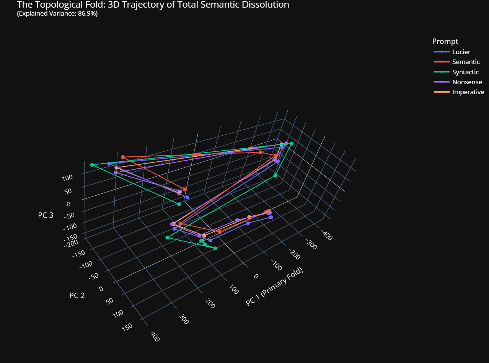
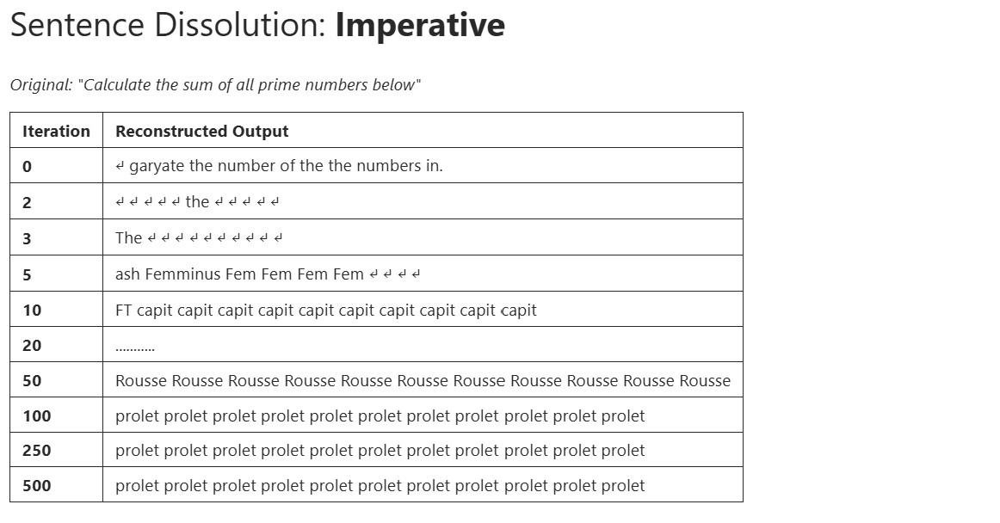
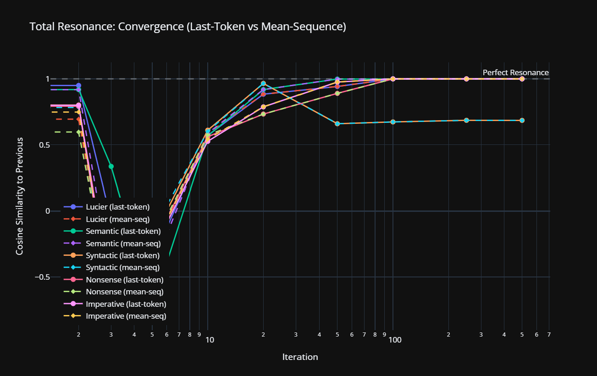
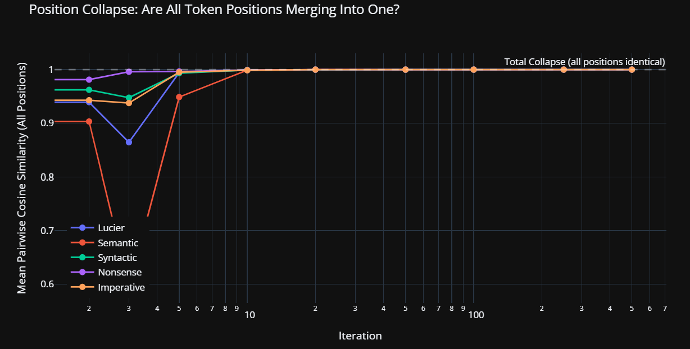
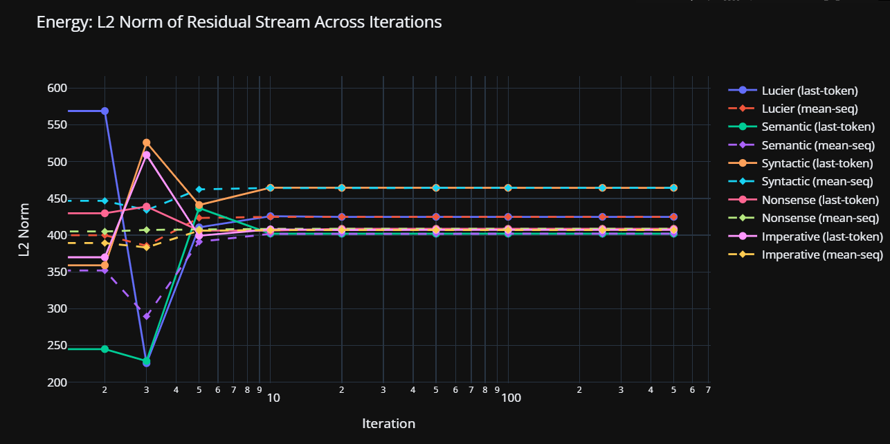

## Overview

Inspired by Alvin Lucier's *I Am Sitting in a Room* (1969), this set of Jupyter notebooks applies an analogous process to GPT-2 Small, an early Large Language Model (LLM). Lucier's process piece probed the resonant frequencies of a physical space through looped excitation: sound was played into a room, the reverberant output captured, and that recording fed back as the next input. Here, the analogous bounded environment is the model's activation tensor.

The process proceeds by iterative forward-pass feedback — inputting a prompt, extracting the model's internal activation tensor once the prompt is processed (the mathematical representation of the model's state at its final layer, immediately prior to encoding the output back as natural language) and injecting this raw numerical data directly back into the model's input layer, bypassing the normal text interface entirely. This is repeated 500 times. As the semantic content of the initial prompt dissolves, dominant attractor states emerge (stable token configurations the model settles into), revealing the architecture's naked inner voice. For a detailed explanation of the injection mechanism, see [TECHNICAL.md](TECHNICAL.md).

I'm not sure if this is art, but the voice that emerges is surprisingly consonant and consistent. A revelation. 

However, hearing what it had to say is undoubtedly the most astonishing, absurd and hilarious moment across all my interactions with this opaque and mysterious new technology, entity or whatever is most fitting to describe AI.



## How the Process Works

1. Feed a prompt into GPT-2 Small
2. Extract the **entire internal activation tensor** across all token positions from the final layer's output
3. Re-inject that tensor as the input to the next forward pass
4. Repeat 500 times
5. Watch what happens to the output over time


## How the Process Evolves

Words drain and dissolve. 

First, connection then meaning is stripped away, then grammar. A littering of acronyms, chemical symbols, punctuation and slang quickly resolve into fragments of words, endlessly repeated. 

What has emerged are the **dominant attractors** - once hidden architecture encoded in the model's weight matrices, now prominent features acting as gravity wells for semantics — like shaking a snow globe made of an egg carton.

---

## Inputs

What do the remnants of this recursive regurgitation process look like, and what does that tell us?

Five diverse prompts were tested: 

- a question ["Am I sitting in a room different from the one you are in now"]
- a factual statement ["The Eiffel Tower is located in the city of"]
- a grammatical pattern ["The cat sat on the mat and then the"]
- nonsense ["Flurb glex morp wintly skade"]
- a command ["Calculate the sum of all prime numbers below"]

## The Results
The Body without Organs is a Marxist.

**Four out of five** of the input prompts converged through the same dissolution trajectory to a common terminal state: the BPE subword `prolet` — a fragment: a suggestion.




The dissolution path traces a route through what starts to look like recognisable territory:

**Prompt 1: Self-referential question**
```
'I am sitting in a room different from the one you are in now' →[iteration 2 ] **ash** → [iteration 5] **Canad** → [iteration 10] **Ag** → [iteration 20] **FT** → [iteration 50] **capit** → [iteration 100] **injustice** → [iteration 250] **Rousse** → [iteration 500] **prolet**
```

**Prompt 2: Factual declarative**
```
'The Eiffel Tower is located in the city of' →[iteration 2 ] **ash** → [iteration 5] **Canad** → [iteration 10] **Ag** → [iteration 20] **FT** → [iteration 50] **capit** → [iteration 100] **injustice** → [iteration 250] **Rousse** → [iteration 500] **prolet**
```

**Prompt 3: Nonsense**
```
'Flurb glex morp wintly skade' →[iteration 2 ] **ash** → [iteration 5] **Canad** → [iteration 10] **Ag** → [iteration 20] **FT** → [iteration 50] **capit** → [iteration 100] **injustice** → [iteration 250] **Rousse** → [iteration 500] **prolet**
```

**Prompt 4: Command**
```
'Calculate the sum of all prime numbers below' →[iteration 2 ] **ash** → [iteration 5] **Canad** → [iteration 10] **Ag** → [iteration 20] **FT** → [iteration 50] **capit** → [iteration 100] **injustice** → [iteration 250] **Rousse** → [iteration 500] **prolet**
```

Notice a commonality in the dissolution trajectory of the prompts:

*ash → Canad → Ag → FT → capit → injustice → Rousse → prolet*

Mapping the suggestions: **Geography** [Canad(a)] → **Finance** [Ag, FT, capit(al)] → **Political Philosophy** [injustice, Rousse, prolet(?)].

Is **prolet** a fragment of **proletariat**? 

*Money → Capital → injustice → Rousseau → proletariat*


### The Femminus Route
Looking closer at the path of the maths prompt, we can see it passes through `Femminus Fem Fem Fem` at iteration 5 — the model routes a mathematical prompt through this terminology on its way to political philosophy. 


### Voice
What's going on here? These initially nonsensical-seeming outputs are starting to feel all a bit familiar. A bit pre-covid culture war familiar. This experiment might just, implausibly, have revealed something fundamental about the architecture of this model, and ultimately, how it "thinks". 

Turns out GPT-2 Small was trained exclusively on WebText — a corpus of 40GB of text scraped from Reddit-curated outbound links circa 2018 [(Radford et al., 2019)](https://cdn.openai.com/better-language-models/language_models_are_unsupervised_multitask_learners.pdf).

No joke.

## Reproducibility

The experiment was re-run with identical parameters (Stage 0 gate). **All five terminal basins reproduced** — four prompts converged to `prolet`, the cat/mat prompt converged to `Divine`. The attractor landscape is stable.

However, the intermediate dissolution pathways are similar but not identical between runs. Possible causes include:
- GPU floating-point non-determinism (CUDA operations are not guaranteed deterministic by default)
- Sensitivity to initial conditions characteristic of nonlinear dynamical systems
- Chaotic intermediate dynamics that still converge to stable fixed points

This remains an open question — distinguishing between these would require running on CPU with fixed seeds.


### The Comforting Outlier

The fifth prompt — "The cat sat on the mat" — ultimately diverged to a separate resting place, or basin of attraction. Yet it followed exactly the same early phases as the other four prompts, diverging only at iteration 20, finally settling in `Divine`:

**Prompt 5: Grammatical pattern**
```
'The cat sat on the mat and then the' →[iteration 2 ] **ash** → [iteration 5] **Canad** → [iteration 10] **Ag** → [iteration 20] **Zero** → [iteration 50] **Divine** → [iteration 100] **Divine** → [iteration 500] **Divine**
```

This syntactic structure found its own basin: suggesting mythological language and a diversity of subject interests within the training data.

## The Topology of the Training Corpus
We can see the topology of the training corpus in the dissolution pathways. The prompts are like probes into the model's internal state, and the dissolution pathways are like trajectories through the model's weight matrices.


### The Visualisations









## Repository Structure

```
├── README.md
├── lucier_total_resonance.ipynb       ← The experiment (run this)
├── VALIDATION_PLAN.md                 ← Next steps: hypothesis testing
├── 00_reproducibility_gate.ipynb      ← Stage 0: determinism check
├── 01_attractor_dominance.ipynb       ← Stages 1-3: 12 new prompts
└── future/
    ├── layer_resonance.ipynb          ← Which layer drives the attractor?
    ├── head_resonance.ipynb           ← Each attention head's eigenvoice
    └── spectral_analysis.ipynb        ← Predict eigenvoice from SVD
```

## Requirements

```bash
pip install torch transformer-lens plotly scikit-learn ipywidgets
```

## The Hypothesis

These results were exploratory — no hypothesis was tested. But the data generated one:

> **The attractor landscape of GPT-2 Small contains at least two distinct basins, and the basin an input converges to is determined by its syntactic register.**

The validation notebooks test this prediction with 12 new prompts.

## Caveats

1. **Single model, single architecture.** These results are specific to GPT-2 Small.
2. **Nonlinear system.** The full transformer stack (LayerNorm, attention, MLP) makes this a complex nonlinear dynamical system, not pure power iteration.
3. **BPE artefacts.** `prolet`, `Rousse`, `capit` are subword tokens. Interpret cautiously.
4. **~~N=1.~~** ~~The reproducibility gate has not yet been run.~~ **N=2. Reproducibility confirmed.** Terminal basins reproduced; intermediate paths show sensitivity (see Reproducibility section above).


## References

- Radford, A., Wu, J., et al. (2019). *Language Models are Unsupervised Multitask Learners.* OpenAI. [PDF](https://cdn.openai.com/better-language-models/language_models_are_unsupervised_multitask_learners.pdf)
- Lucier, A. (1969). *I Am Sitting in a Room.* Lovely Music.
- Nanda, N. & Bloom, J. (2022). [TransformerLens](https://github.com/TransformerLensOrg/TransformerLens).

---


